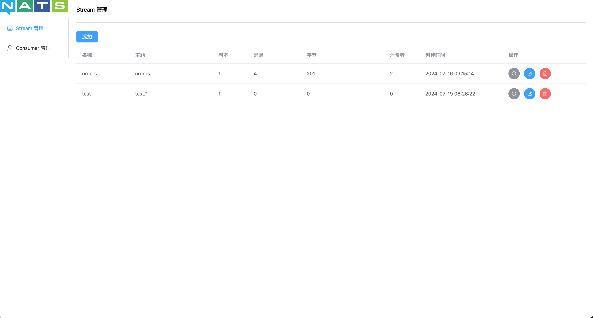

# nats-webui

nats 服务后台



## 技术栈
- vue3 组合式 api
- tailwind CSS
- go

## 功能
- 节点管理
- stream 管理
- consumer 管理

## 依赖
```
nats-server -js
```
## 构建容器
```
docker build -t nats-webui:v1.0 .
```

## 启动
```
// 推荐 容器启动
docker run -p 8081:80 -d nats-webui:v1.0

// 手动启动
cd server
go mod tidy
go run main.go

cd web
npm run dev
```


## 目录
[前端](web)
[后端](server)

## TODO
- 集群管理
- KV 存储